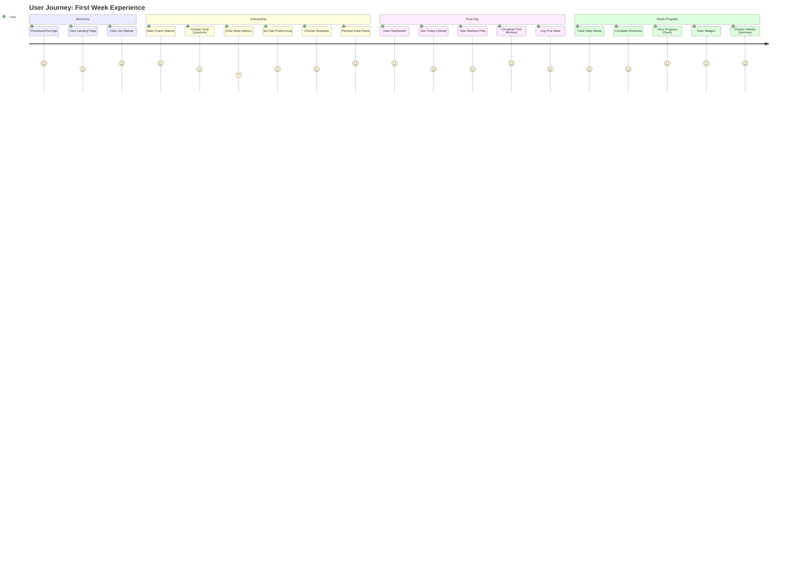
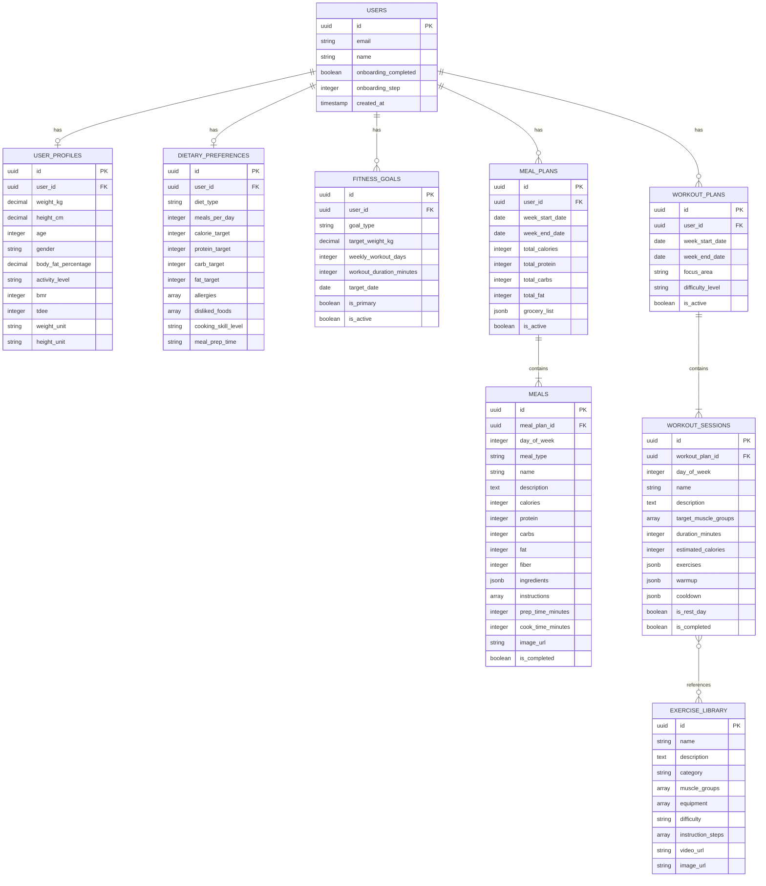

# 🚀 Liftoff Fitness Coaching System - Complete Implementation Plan

> A comprehensive, gamified fitness coaching application featuring personalized onboarding, AI-generated meal plans with nutritional breakdowns, and tailored workout routines.

---

## Table of Contents

1. [Executive Summary](#executive-summary)
2. [Design Philosophy](#design-philosophy)
3. [User Journey Map](#user-journey-map)
4. [Onboarding Flow Specification](#onboarding-flow-specification)
5. [Database Architecture](#database-architecture)
6. [AI Plan Generation System](#ai-plan-generation-system)
7. [Meal Planning Module](#meal-planning-module)
8. [Workout Planning Module](#workout-planning-module)
9. [Dashboard & Navigation](#dashboard--navigation)
10. [UI/UX Specifications](#uiux-specifications)
11. [API Architecture](#api-architecture)
12. [Gamification System](#gamification-system)
13. [Data Persistence Strategy](#data-persistence-strategy)
14. [Verification & Testing Plan](#verification--testing-plan)

---

## Executive Summary

### Project Vision

Build a **premium mobile-first fitness coaching web application** inspired by the Liftoff app's gamified approach. The system will collect comprehensive user data through an engaging, conversational onboarding experience and use AI to generate hyper-personalized weekly meal plans and workout routines.

### Core Features

| Feature | Description |
|---------|-------------|
| **Gamified Onboarding** | Chat-like interface with friendly mascot guiding users through setup |
| **Body Metrics Tracking** | Weight, height, age, body fat %, activity level with visual inputs |
| **AI Meal Planning** | Weekly personalized meal plans with complete nutritional information |
| **AI Workout Generation** | Tailored exercise routines based on goals, level, and equipment |
| **Progress Visualization** | Charts, body graphs, and rank progression displays |
| **Plan Customization** | Ability to swap meals, modify workouts, and adjust preferences |
| **Grocery List Generation** | Auto-generated shopping lists from meal plans |

### Technology Stack

- **Frontend:** Next.js 16, React 19, Tailwind CSS 4, Framer Motion
- **Backend:** Next.js API Routes, Server Actions
- **Database:** PostgreSQL 16 with Drizzle ORM
- **AI:** Gemini AI (Google) for plan generation
- **Authentication:** NextAuth.js 5
- **State Management:** React Context + Server State
- **Styling:** Tailwind CSS with custom design system

---

## Design Philosophy

### Liftoff-Inspired Principles

1. **Gamification First**
   - Every action earns XP and contributes to user rank
   - Visual rank progression pyramid
   - Achievement badges for milestones
   - Competitive leaderboards

2. **Conversational Onboarding**
   - Mascot character guides the experience (similar to Liftoff's "Jymbo")
   - Chat-bubble style question flow
   - Short, focused questions one at a time
   - Immediate visual feedback after each response

3. **Clean, Focused Interface**
   - Information shown only when needed
   - Dark mode primary with vibrant accent colors
   - Large, tappable elements for mobile
   - Smooth micro-animations throughout

4. **Meaningful Feedback**
   - Immediate rank calculation after setup
   - Predictive progress graphs
   - Clear visualization of workout impact (body heatmaps)
   - Daily/weekly goal progress indicators

---

## User Journey Map

---

## Onboarding Flow Specification

### Overview

The onboarding consists of **8 progressive steps** presented in a conversational, chat-like interface. Each step collects specific data while maintaining engagement through animations and immediate feedback.

### Step 1: Welcome & Mascot Introduction

**Screen Name:** `WelcomeScreen`

**Content:**
- Animated mascot character entrance (e.g., "Coach Lift" - a friendly fitness robot/character)
- Welcome message: "Hey there! I'm Coach Lift, your personal fitness guide 🏋️"
- Motivational tagline: "Let's build something amazing together"
- Single CTA button: "Let's Go!"

**Animations:**
- Mascot bounces in from bottom
- Text fades in sequentially
- Button pulses gently

**Data Collected:** None (purely engagement)

---

### Step 2: Goal Selection

**Screen Name:** `GoalSelectionScreen`

**Coach Message:** "First things first - what's your main mission? 🎯"

**Options (Visual Cards):**

| Goal | Icon | Description |
|------|------|-------------|
| Lose Weight | 📉 | Shed fat and get leaner |
| Build Muscle | 💪 | Gain strength and size |
| Get Toned | ✨ | Define muscles, stay lean |
| Improve Endurance | 🏃 | Boost stamina and cardio |
| Maintain Fitness | ⚖️ | Keep current shape |
| General Health | ❤️ | Feel better overall |

**Interaction:**
- Single selection required
- Card scales up on selection
- Haptic feedback on mobile
- Auto-advance after 0.5s delay

**Data Collected:** `goalType: string`

---

### Step 3: Body Metrics - Weight

**Screen Name:** `WeightInputScreen`

**Coach Message:** "What's your current weight? Don't worry, this stays between us! 🤫"

**Input Type:** Visual slider/picker with large number display

**Features:**
- Unit toggle: kg / lbs
- Range: 30-250 kg (66-550 lbs)
- Large, easily readable number
- Animated scale graphic

**Validation:**
- Minimum 30 kg / 66 lbs
- Maximum 250 kg / 550 lbs

**Data Collected:** `currentWeightKg: number`, `weightUnit: 'kg' | 'lbs'`

---

### Step 4: Body Metrics - Height

**Screen Name:** `HeightInputScreen`

**Coach Message:** "How tall are you? Standing straight now! 📏"

**Input Type:** Visual height picker with avatar silhouette

**Features:**
- Unit toggle: cm / ft'in"
- Range: 100-250 cm (3'3" - 8'2")
- Avatar silhouette that scales with selection
- Gridline background for visual reference

**Data Collected:** `heightCm: number`, `heightUnit: 'cm' | 'ft'`

---

### Step 5: Personal Details

**Screen Name:** `PersonalDetailsScreen`

**Coach Message:** "A few more details to personalize your experience 🎂"

**Fields:**

| Field | Input Type | Options/Range |
|-------|-----------|---------------|
| Age | Number picker | 13-100 years |
| Gender | Selection cards | Male, Female, Other, Prefer not to say |
| Activity Level | Illustrated cards | Sedentary, Lightly Active, Moderately Active, Very Active, Extra Active |

**Activity Level Descriptions:**
- **Sedentary:** Desk job, little exercise
- **Lightly Active:** Light exercise 1-3 days/week
- **Moderately Active:** Moderate exercise 3-5 days/week
- **Very Active:** Hard exercise 6-7 days/week
- **Extra Active:** Athlete or physical job

**Data Collected:** `age: number`, `gender: string`, `activityLevel: string`

---

### Step 6: Dietary Preferences

**Screen Name:** `DietaryPreferencesScreen`

**Coach Message:** "Let's talk food! What's your eating style? 🥗"

**Section A - Diet Type (Single Select):**

| Diet | Description |
|------|-------------|
| Balanced | No restrictions, variety of foods |
| Low Carb | Reduced carbohydrates |
| High Protein | Extra protein focus |
| Keto | Very low carb, high fat |
| Vegetarian | No meat |
| Vegan | No animal products |
| Mediterranean | Olive oil, fish, whole grains |
| Paleo | Whole foods, no processed |

**Section B - Allergies & Restrictions (Multi-Select Chips):**
- Dairy-free
- Gluten-free
- Nut-free
- Shellfish-free
- Egg-free
- Soy-free
- No pork
- No beef
- Halal
- Kosher

**Section C - Meals Per Day (Slider):**
- Range: 2-6 meals
- Visual meal icons appear/disappear

**Data Collected:** `dietType: string`, `allergies: string[]`, `mealsPerDay: number`

---

### Step 7: Schedule & Availability

**Screen Name:** `ScheduleScreen`

**Coach Message:** "When can you work out? Let's build your weekly rhythm 📅"

**Section A - Workout Days (Toggle Grid):**
- 7-day week grid (Mon-Sun)
- Tap to toggle each day
- Recommended: 3-5 days highlighted

**Section B - Workout Duration (Slider):**
- Range: 15-120 minutes
- Presets: 30, 45, 60, 90 minutes
- Visual timer icon animates

**Section C - Meal Prep Time (Selection):**
- Quick (15 min): Simple recipes
- Medium (30 min): Standard cooking
- Extended (45+ min): Full preparation

**Section D - Cooking Skill (Selection):**
- Beginner: Basic recipes only
- Intermediate: Moderate complexity
- Advanced: Full range available

**Data Collected:** 
- `workoutDays: number[]` (0-6 for Sun-Sat)
- `workoutDurationMinutes: number`
- `mealPrepTime: 'quick' | 'medium' | 'extended'`
- `cookingSkill: 'beginner' | 'intermediate' | 'advanced'`

---

### Step 8: Target Goals & Timeline

**Screen Name:** `TargetGoalsScreen`

**Coach Message:** "Let's set your target! Where do you want to be? 🎯"

**Conditional Display Based on Goal:**

**For Weight Loss:**
- Target weight slider/picker
- Calculated safe loss rate (0.5-1 kg/week)
- Estimated timeline display
- Warning if rate exceeds safe limits

**For Muscle Gain:**
- Target weight (optional)
- Focus areas selection (Upper, Lower, Core, Full Body)
- Expected timeline for visible results

**For All Goals:**
- Target date picker (optional)
- Motivation reminders preference
- Progress photo consent checkbox

**Data Collected:** 
- `targetWeightKg: number` (optional)
- `targetDate: Date` (optional)
- `focusAreas: string[]`

---

### Step 9: Rank Calculation & Summary

**Screen Name:** `RankRevealScreen`

**Experience:**
1. Loading animation with "Calculating your profile..."
2. BMR and TDEE calculation display
3. Rank reveal with animation
4. Rank pyramid visualization
5. Predicted progress graph
6. Summary card with all inputs

**Displayed Metrics:**
- Starting Rank (Bronze I - Diamond V)
- Daily Calorie Target
- Macro Split (Protein/Carbs/Fat)
- Weekly Workout Target
- Estimated Progress Timeline

**Final CTA:** "Start My Journey" → Navigate to Dashboard

---

## Database Architecture

### Entity Relationship Diagram

---

### Table Specifications

#### 1. user_profiles

Stores comprehensive body metrics and calculated values.

| Column | Type | Constraints | Description |
|--------|------|-------------|-------------|
| id | UUID | PK, auto-gen | Unique identifier |
| user_id | UUID | FK → users.id, unique | Reference to user |
| weight_kg | DECIMAL(5,2) | nullable | Current weight in kg |
| height_cm | DECIMAL(5,2) | nullable | Height in centimeters |
| age | INTEGER | nullable | User's age |
| gender | VARCHAR(20) | nullable | male/female/other/prefer_not_to_say |
| body_fat_percentage | DECIMAL(4,1) | nullable | Body fat % |
| activity_level | VARCHAR(30) | nullable | Activity category |
| bmr | INTEGER | nullable | Basal Metabolic Rate (calculated) |
| tdee | INTEGER | nullable | Total Daily Energy Expenditure |
| weight_unit | VARCHAR(5) | default 'kg' | Preferred weight unit |
| height_unit | VARCHAR(5) | default 'cm' | Preferred height unit |
| created_at | TIMESTAMP | default now() | Creation timestamp |
| updated_at | TIMESTAMP | default now() | Last update timestamp |

**Calculated Fields Logic:**
- **BMR (Mifflin-St Jeor):**
  - Male: (10 × weight) + (6.25 × height) - (5 × age) + 5
  - Female: (10 × weight) + (6.25 × height) - (5 × age) - 161
- **TDEE:** BMR × Activity Multiplier
  - Sedentary: 1.2
  - Lightly Active: 1.375
  - Moderately Active: 1.55
  - Very Active: 1.725
  - Extra Active: 1.9

---

#### 2. fitness_goals

Supports multiple goals with primary designation.

| Column | Type | Constraints | Description |
|--------|------|-------------|-------------|
| id | UUID | PK | Unique identifier |
| user_id | UUID | FK → users.id | Reference to user |
| goal_type | VARCHAR(30) | NOT NULL | lose_weight/build_muscle/get_toned/improve_endurance/maintain/general_health |
| target_weight_kg | DECIMAL(5,2) | nullable | Goal weight |
| target_body_fat | DECIMAL(4,1) | nullable | Goal body fat % |
| weekly_workout_days | INTEGER | default 3 | Target workout frequency |
| workout_duration_minutes | INTEGER | default 45 | Target session length |
| target_date | DATE | nullable | Goal deadline |
| focus_areas | TEXT[] | nullable | Array of focus body areas |
| is_primary | BOOLEAN | default true | Primary goal flag |
| is_active | BOOLEAN | default true | Active goal flag |
| created_at | TIMESTAMP | default now() | Creation timestamp |

---

#### 3. dietary_preferences

Complete dietary configuration for meal planning.

| Column | Type | Constraints | Description |
|--------|------|-------------|-------------|
| id | UUID | PK | Unique identifier |
| user_id | UUID | FK, unique | Reference to user |
| diet_type | VARCHAR(30) | nullable | balanced/keto/low_carb/high_protein/vegetarian/vegan/mediterranean/paleo |
| meals_per_day | INTEGER | default 3 | Number of meals |
| calorie_target | INTEGER | nullable | Daily calories (calculated or custom) |
| protein_target | INTEGER | nullable | Daily protein grams |
| carb_target | INTEGER | nullable | Daily carb grams |
| fat_target | INTEGER | nullable | Daily fat grams |
| allergies | TEXT[] | nullable | List of allergies |
| disliked_foods | TEXT[] | nullable | Foods to avoid |
| cuisine_preferences | TEXT[] | nullable | Preferred cuisines |
| budget_level | VARCHAR(20) | default 'medium' | low/medium/high |
| cooking_skill_level | VARCHAR(20) | default 'intermediate' | beginner/intermediate/advanced |
| meal_prep_time | VARCHAR(20) | default 'medium' | quick/medium/extended |
| created_at | TIMESTAMP | default now() | Creation timestamp |
| updated_at | TIMESTAMP | default now() | Last update timestamp |

**Macro Calculation by Goal:**

| Goal | Protein | Carbs | Fat |
|------|---------|-------|-----|
| Lose Weight | 30% | 35% | 35% |
| Build Muscle | 35% | 40% | 25% |
| Get Toned | 30% | 40% | 30% |
| Endurance | 20% | 55% | 25% |
| Maintain | 25% | 45% | 30% |
| General Health | 25% | 45% | 30% |

---

#### 4. meal_plans

Weekly meal plan containers.

| Column | Type | Description |
|--------|------|-------------|
| id | UUID | Primary key |
| user_id | UUID | Reference to user |
| week_start_date | DATE | Monday of the week |
| week_end_date | DATE | Sunday of the week |
| total_calories | INTEGER | Sum of all meals |
| total_protein | INTEGER | Sum in grams |
| total_carbs | INTEGER | Sum in grams |
| total_fat | INTEGER | Sum in grams |
| grocery_list | JSONB | Generated shopping list |
| ai_generated_at | TIMESTAMP | When AI created plan |
| is_active | BOOLEAN | Current active plan |
| created_at | TIMESTAMP | Creation timestamp |
| updated_at | TIMESTAMP | Last update |

---

#### 5. meals

Individual meals with complete nutritional data.

| Column | Type | Description |
|--------|------|-------------|
| id | UUID | Primary key |
| meal_plan_id | UUID | Reference to meal plan |
| day_of_week | INTEGER | 0=Sunday, 6=Saturday |
| meal_type | VARCHAR(20) | breakfast/lunch/dinner/snack |
| name | VARCHAR(255) | Meal name |
| description | TEXT | Brief description |
| calories | INTEGER | Calorie count |
| protein | INTEGER | Protein grams |
| carbs | INTEGER | Carbohydrate grams |
| fat | INTEGER | Fat grams |
| fiber | INTEGER | Fiber grams |
| sugar | INTEGER | Sugar grams |
| sodium | INTEGER | Sodium mg |
| ingredients | JSONB | Array of {name, amount, unit, calories, protein, carbs, fat} |
| instructions | TEXT[] | Step-by-step cooking |
| prep_time_minutes | INTEGER | Preparation time |
| cook_time_minutes | INTEGER | Cooking time |
| servings | INTEGER | Number of servings |
| image_url | TEXT | Meal image |
| tags | TEXT[] | quick/high-protein/vegetarian/etc |
| is_completed | BOOLEAN | Eaten flag |
| completed_at | TIMESTAMP | When eaten |
| created_at | TIMESTAMP | Creation timestamp |

---

#### 6. workout_plans

Weekly workout plan containers.

| Column | Type | Description |
|--------|------|-------------|
| id | UUID | Primary key |
| user_id | UUID | Reference to user |
| week_start_date | DATE | Monday of the week |
| week_end_date | DATE | Sunday of the week |
| focus_area | VARCHAR(50) | full_body/upper_lower/push_pull_legs/custom |
| difficulty_level | VARCHAR(20) | beginner/intermediate/advanced |
| total_workouts | INTEGER | Number of workout days |
| total_rest_days | INTEGER | Number of rest days |
| ai_generated_at | TIMESTAMP | When AI created plan |
| is_active | BOOLEAN | Current active plan |
| created_at | TIMESTAMP | Creation timestamp |
| updated_at | TIMESTAMP | Last update |

---

#### 7. workout_sessions

Individual workout day details.

| Column | Type | Description |
|--------|------|-------------|
| id | UUID | Primary key |
| workout_plan_id | UUID | Reference to workout plan |
| day_of_week | INTEGER | 0=Sunday, 6=Saturday |
| name | VARCHAR(255) | Workout name (e.g., "Upper Body Power") |
| description | TEXT | Workout overview |
| target_muscle_groups | TEXT[] | chest/back/shoulders/arms/core/legs |
| duration_minutes | INTEGER | Expected duration |
| estimated_calories_burned | INTEGER | Calorie estimate |
| warmup | JSONB | Array of {exercise, duration_seconds} |
| exercises | JSONB | Array of {exercise_id, name, sets, reps, weight_kg, rest_seconds, notes, superset_with} |
| cooldown | JSONB | Array of {exercise, duration_seconds} |
| is_rest_day | BOOLEAN | Rest day flag |
| rest_day_activity | VARCHAR(50) | light_walk/stretching/none |
| is_completed | BOOLEAN | Completed flag |
| completed_at | TIMESTAMP | When completed |
| actual_duration_minutes | INTEGER | Real duration |
| difficulty_rating | INTEGER | User rating 1-5 |
| notes | TEXT | User notes |
| created_at | TIMESTAMP | Creation timestamp |

---

#### 8. exercise_library

Reference database of exercises.

| Column | Type | Description |
|--------|------|-------------|
| id | UUID | Primary key |
| name | VARCHAR(255) | Exercise name |
| description | TEXT | Exercise description |
| category | VARCHAR(50) | strength/cardio/flexibility/balance/plyometric |
| muscle_groups | TEXT[] | Primary and secondary muscles |
| equipment | TEXT[] | Required equipment |
| difficulty | VARCHAR(20) | beginner/intermediate/advanced |
| instruction_steps | TEXT[] | How to perform |
| tips | TEXT[] | Form tips |
| common_mistakes | TEXT[] | What to avoid |
| video_url | TEXT | Tutorial video |
| image_url | TEXT | Static image |
| calories_per_minute | INTEGER | Calorie burn rate |
| is_compound | BOOLEAN | Multi-joint movement |
| is_active | BOOLEAN | Available flag |
| created_at | TIMESTAMP | Creation timestamp |

---

## AI Plan Generation System

### Overview

The AI system uses Gemini (Google AI) to generate personalized meal and workout plans based on user profile data. Plans are generated weekly with options for manual regeneration.

### Generation Triggers

1. **Initial Generation:** Immediately after onboarding completion
2. **Weekly Refresh:** Every Monday at 00:00 user timezone
3. **Manual Regeneration:** User-triggered from settings
4. **Profile Update:** When significant changes occur (weight, goal, diet type)

### Meal Plan Generation

#### Input Data to AI

| Category | Data Points |
|----------|-------------|
| User Metrics | Weight, height, age, gender, activity level |
| Targets | Daily calories, protein/carb/fat split |
| Preferences | Diet type, meals per day, cooking skill |
| Restrictions | Allergies, disliked foods |
| Practical | Prep time limit, budget level |

#### AI Prompt Structure

The prompt should instruct the AI to:

1. Generate 7 days of meals (breakfast, lunch, dinner, + snacks if applicable)
2. Hit daily calorie/macro targets within 5% tolerance
3. Avoid all listed allergies and disliked foods
4. Match cooking skill level and prep time constraints
5. Provide variety (no exact repeat meals in a week)
6. Include complete nutritional breakdown per meal
7. List all ingredients with quantities
8. Provide step-by-step cooking instructions
9. Suggest meal prep opportunities (batch cooking)

#### AI Output Format

Structured JSON with:
- Day-by-day meal breakdown
- Complete nutritional data per meal
- Ingredient lists with quantities
- Cooking instructions
- Prep/cook time estimates
- Shopping list aggregation

### Workout Plan Generation

#### Input Data to AI

| Category | Data Points |
|----------|-------------|
| User Metrics | Age, gender, current fitness level |
| Goals | Primary goal, focus areas |
| Schedule | Available days, session duration |
| Equipment | Home/gym, available equipment list |
| Limitations | Injuries, movement restrictions |

#### AI Prompt Structure

The prompt should instruct the AI to:

1. Generate workouts for specified days with rest days
2. Match session duration within 10% tolerance
3. Align exercises with primary goal
4. Progressive difficulty through the week
5. Balance muscle groups appropriately
6. Include warmup (5-10 min) and cooldown (5 min)
7. Provide sets, reps, and rest periods
8. Estimate calories burned per session
9. Include exercise substitution options

#### Workout Split Options by Days

| Days/Week | Recommended Split |
|-----------|-------------------|
| 2 days | Full Body A, Full Body B |
| 3 days | Full Body A, B, C or Push/Pull/Legs |
| 4 days | Upper/Lower × 2 |
| 5 days | Push/Pull/Legs/Upper/Lower |
| 6 days | Push/Pull/Legs × 2 |

---

## Meal Planning Module

### Daily Meal View

**Screen:** `DailyMealsScreen`

**Layout:**
- Date header with day navigation arrows
- Calorie/macro summary progress rings
- Meal cards stacked vertically
- Quick-add snack button

**Meal Card Content:**
- Meal type label (Breakfast/Lunch/etc.)
- Meal name and image
- Calorie and macro summary
- Prep time badge
- Completion checkbox
- Expand for full details

### Meal Detail View

**Screen:** `MealDetailScreen`

**Sections:**

1. **Header**
   - Full-width meal image
   - Meal name
   - Prep + Cook time
   - Servings count

2. **Nutrition Panel**
   - Calories (large, centered)
   - Macro breakdown with visual bars
   - Detailed nutrients expandable

3. **Ingredients List**
   - Ingredient name
   - Quantity and unit
   - Checkbox for preparation tracking
   - Nutritional contribution

4. **Instructions**
   - Numbered steps
   - Timer buttons for timed steps
   - Image hints where helpful

5. **Actions**
   - "Mark as Eaten" button
   - "Swap Meal" option
   - "Save to Favorites" option
   - "Share" option

### Weekly Meal Overview

**Screen:** `WeeklyMealPlanScreen`

**Layout:**
- Week date range header
- Day tabs (Mon-Sun)
- Compact meal cards per day
- Weekly nutrition summary
- "View Grocery List" CTA

### Grocery List

**Screen:** `GroceryListScreen`

**Features:**
- Categorized by food type (Produce, Dairy, Proteins, etc.)
- Quantity aggregation across all meals
- Checkbox for purchased items
- Option to add custom items
- "Share List" functionality
- Print-friendly view

**Categories:**
1. Fresh Produce
2. Dairy & Eggs
3. Meat & Seafood
4. Grains & Bread
5. Canned & Packaged
6. Frozen Foods
7. Condiments & Spices
8. Beverages

---

## Workout Planning Module

### Today's Workout View

**Screen:** `TodayWorkoutScreen`

**Layout:**
- Workout name header
- Duration and calorie estimate
- Target muscle group icons
- Phase tabs (Warmup / Main / Cooldown)
- Exercise list
- "Start Workout" CTA

### Workout Execution Mode

**Screen:** `WorkoutActiveScreen`

**Features:**
- Current exercise display (large)
- Set/Rep counter
- Rest timer with audio cues
- Previous/Next exercise navigation
- Weight logging input
- Form tips tooltip
- "Skip Exercise" option
- Progress indicator

### Exercise Detail

**Screen:** `ExerciseDetailScreen`

**Content:**
- Exercise name
- Video demonstration (autoplay muted)
- Target muscles diagram (body map)
- Equipment needed
- Step-by-step instructions
- Common mistakes to avoid
- Pro tips
- Alternative exercises

### Weekly Workout Overview

**Screen:** `WeeklyWorkoutPlanScreen`

**Layout:**
- Week date range header
- Day cards in grid/list
- Rest day indicators
- Completion status per day
- Body map showing week's coverage
- Weekly summary stats

---

## Dashboard & Navigation

### Main Dashboard

**Screen:** `DashboardScreen`

**Sections (Top to Bottom):**

1. **Greeting Header**
   - Time-based greeting ("Good Morning, [Name]!")
   - Current date
   - Streak counter
   - Settings icon

2. **Daily Score Card**
   - Circular progress ring (meals + workout completion)
   - XP earned today
   - Points to next level

3. **Today's Quick View**
   - Next meal card (condensed)
   - Today's workout card (condensed)
   - Tap to navigate to full views

4. **Weekly Progress**
   - Mini calendar with completion dots
   - Streak visualization
   - Weekly stats summary

5. **My Rank**
   - Current rank badge
   - Progress to next rank
   - Leaderboard position

6. **Quick Actions**
   - Log Water
   - Log Weight
   - View Progress Photos

### Bottom Navigation

| Tab | Icon | Screen |
|-----|------|--------|
| Home | 🏠 | Dashboard |
| Meals | 🍽️ | Daily Meals |
| Workout | 💪 | Today's Workout |
| Progress | 📊 | Analytics |
| Profile | 👤 | User Profile |

---

## UI/UX Specifications

### Design System

#### Color Palette

| Role | Light Mode | Dark Mode |
|------|------------|-----------|
| Background | #FFFFFF | #0D0D0D |
| Surface | #F5F5F5 | #1A1A1A |
| Surface Elevated | #EBEBEB | #262626 |
| Primary | #6366F1 (Indigo) | #818CF8 |
| Secondary | #10B981 (Emerald) | #34D399 |
| Accent | #F59E0B (Amber) | #FBBF24 |
| Error | #EF4444 | #F87171 |
| Text Primary | #111827 | #F9FAFB |
| Text Secondary | #6B7280 | #9CA3AF |

#### Typography

| Element | Font | Weight | Size |
|---------|------|--------|------|
| H1 | Inter | Bold | 32px |
| H2 | Inter | SemiBold | 24px |
| H3 | Inter | SemiBold | 20px |
| Body | Inter | Regular | 16px |
| Body Small | Inter | Regular | 14px |
| Caption | Inter | Medium | 12px |
| Button | Inter | SemiBold | 16px |

#### Spacing System

- Base unit: 4px
- Scale: 4, 8, 12, 16, 20, 24, 32, 40, 48, 64

#### Border Radius

| Size | Value |
|------|-------|
| Small | 8px |
| Medium | 12px |
| Large | 16px |
| XL | 24px |
| Full | 9999px |

### Animation Guidelines

| Interaction | Animation | Duration | Easing |
|-------------|-----------|----------|--------|
| Page Transition | Slide + Fade | 300ms | ease-out |
| Card Press | Scale down 0.98 | 100ms | ease-in |
| Button Tap | Scale pulse | 150ms | ease-in-out |
| Modal Open | Slide up + Fade | 250ms | ease-out |
| Modal Close | Slide down + Fade | 200ms | ease-in |
| Progress Ring | Animate fill | 1000ms | ease-out |
| Skeleton Load | Shimmer | 1500ms | linear |
| Success | Checkmark draw | 400ms | ease-out |

### Component Library

| Component | Usage |
|-----------|-------|
| Card | Container for meals, workouts, stats |
| ProgressRing | Circular progress for macros, goals |
| Slider | Input for weight, height, duration |
| SelectionCard | Large tappable option cards |
| Chip | Tags, multi-select options |
| Badge | Rank, status, labels |
| IconButton | Navigation, quick actions |
| BottomSheet | Meal details, exercise info |
| Toast | Success/error notifications |
| Skeleton | Loading placeholders |

---

## API Architecture

### Endpoint Structure

#### Onboarding

| Method | Path | Description |
|--------|------|-------------|
| GET | `/api/onboarding` | Get current onboarding status |
| POST | `/api/onboarding/step/:step` | Save step data |
| POST | `/api/onboarding/complete` | Complete onboarding, trigger plan generation |

#### User Profile

| Method | Path | Description |
|--------|------|-------------|
| GET | `/api/profile` | Get user profile |
| PUT | `/api/profile` | Update profile |
| GET | `/api/profile/metrics` | Get body metrics history |
| POST | `/api/profile/metrics` | Log new metrics |

#### Meal Plans

| Method | Path | Description |
|--------|------|-------------|
| GET | `/api/plans/meals` | Get current week's meal plan |
| GET | `/api/plans/meals/week/:date` | Get specific week's plan |
| POST | `/api/plans/meals/generate` | Regenerate meal plan |
| PUT | `/api/plans/meals/:mealId` | Update specific meal |
| POST | `/api/plans/meals/:mealId/swap` | Swap meal with alternative |
| POST | `/api/plans/meals/:mealId/complete` | Mark meal as eaten |
| GET | `/api/plans/meals/grocery-list` | Get generated grocery list |

#### Workout Plans

| Method | Path | Description |
|--------|------|-------------|
| GET | `/api/plans/workouts` | Get current week's workout plan |
| GET | `/api/plans/workouts/week/:date` | Get specific week's plan |
| POST | `/api/plans/workouts/generate` | Regenerate workout plan |
| PUT | `/api/plans/workouts/:sessionId` | Update workout session |
| POST | `/api/plans/workouts/:sessionId/complete` | Mark workout complete |
| GET | `/api/plans/workouts/:sessionId/exercises` | Get exercise details |

#### Exercise Library

| Method | Path | Description |
|--------|------|-------------|
| GET | `/api/exercises` | List all exercises |
| GET | `/api/exercises/:id` | Get exercise details |
| GET | `/api/exercises/search` | Search exercises |
| GET | `/api/exercises/by-muscle/:muscle` | Filter by muscle group |

---

## Gamification System

### Rank System

Inspired by Liftoff's visual rank pyramid:

| Rank | XP Required | Badge Color |
|------|-------------|-------------|
| Bronze I | 0 | #CD7F32 |
| Bronze II | 500 | #CD7F32 |
| Bronze III | 1,000 | #CD7F32 |
| Silver I | 2,000 | #C0C0C0 |
| Silver II | 3,500 | #C0C0C0 |
| Silver III | 5,000 | #C0C0C0 |
| Gold I | 7,500 | #FFD700 |
| Gold II | 10,000 | #FFD700 |
| Gold III | 15,000 | #FFD700 |
| Platinum I | 20,000 | #E5E4E2 |
| Platinum II | 30,000 | #E5E4E2 |
| Platinum III | 45,000 | #E5E4E2 |
| Diamond I | 60,000 | #B9F2FF |
| Diamond II | 80,000 | #B9F2FF |
| Diamond III | 100,000+ | #B9F2FF |

### XP Earning Actions

| Action | Base XP | Streak Bonus |
|--------|---------|--------------|
| Complete Workout | 100 | +10% per day (max 50%) |
| Log Meal | 25 | +5% per day (max 25%) |
| Complete All Daily Meals | 50 | +10% per day |
| Hit Calorie Target (±5%) | 50 | - |
| Hit Macro Targets | 30 | - |
| Weekly Plan Completion | 200 | - |
| First Workout | 50 | One-time |
| 7-Day Streak | 100 | One-time per achievement |
| 30-Day Streak | 500 | One-time |

### Achievement Badges

| Badge | Requirement |
|-------|-------------|
| First Steps | Complete onboarding |
| Iron Will | First workout completed |
| Kitchen Warrior | First week of meals logged |
| Week Warrior | Complete 7-day workout streak |
| Month Master | Complete 30-day streak |
| Macro Master | Hit all macros for a full week |
| Recipe Explorer | Try 20 different meals |
| Gym Rat | Log 50 workouts |
| Chef Mode | Complete advanced recipes |

---

## Data Persistence Strategy

### Local Storage

- Draft onboarding data (until completion)
- Preferred units (kg/lbs, cm/ft)
- Dark/light mode preference
- Last viewed screens

### Server-Side (PostgreSQL)

- All user data after onboarding
- Generated meal and workout plans
- Completion logs
- Progress metrics
- XP and rank data

### Caching Strategy

| Data Type | Cache Duration | Invalidation |
|-----------|---------------|--------------|
| User Profile | Until modified | On update |
| Current Week Plans | 24 hours | On regeneration |
| Exercise Library | 7 days | On app update |
| Leaderboard | 15 minutes | Scheduled refresh |

---

## Verification & Testing Plan

### Unit Tests

- [ ] BMR/TDEE calculation functions
- [ ] Macro target calculations
- [ ] Date range utilities
- [ ] Grocery list aggregation
- [ ] XP calculation logic

### Integration Tests

- [ ] Onboarding flow data persistence
- [ ] AI plan generation API
- [ ] Meal completion tracking
- [ ] Workout logging
- [ ] Profile update propagation

### E2E Tests

- [ ] Complete new user registration → onboarding → dashboard
- [ ] Weekly plan generation and display
- [ ] Meal swap functionality
- [ ] Workout completion flow
- [ ] Weight logging and progress charts

### Manual Testing Checklist

#### Onboarding
- [ ] All 8 steps complete successfully
- [ ] Data persists on navigation back
- [ ] Validation errors display correctly
- [ ] Animations are smooth (60fps)
- [ ] Works on mobile viewport

#### Dashboard
- [ ] Daily data loads correctly
- [ ] Progress rings animate
- [ ] Navigation between tabs works
- [ ] Streak counter is accurate

#### Meal Planning
- [ ] Weekly plan displays 7 days
- [ ] Nutritional data is accurate
- [ ] Grocery list generates correctly
- [ ] Meal swap provides alternatives
- [ ] Completion marking works

#### Workout Planning
- [ ] Weekly plan shows correct days
- [ ] Rest days are clearly marked
- [ ] Exercise details are accessible
- [ ] Active workout timer works
- [ ] Completion logging saves data

---

## Implementation Phases

### Phase 1: Foundation (Days 1-3)
- Database schema creation and migration
- Basic API structure setup
- Authentication integration

### Phase 2: Onboarding (Days 4-6)
- All 8 onboarding screens
- Data validation and persistence
- Progress indicators and animations

### Phase 3: AI Integration (Days 7-9)
- Gemini API integration
- Meal plan generation prompts
- Workout plan generation prompts
- Response parsing and storage

### Phase 4: Meal Planning UI (Days 10-12)
- Daily meal view
- Meal detail screens
- Weekly overview
- Grocery list generation

### Phase 5: Workout Planning UI (Days 13-15)
- Daily workout view
- Active workout mode
- Exercise details
- Weekly overview

### Phase 6: Dashboard & Polish (Days 16-18)
- Main dashboard
- Progress tracking
- Gamification integration
- UI polish and animations

### Phase 7: Testing & Launch (Days 19-21)
- Comprehensive testing
- Bug fixes
- Performance optimization
- Launch preparation

---

## Success Metrics

| Metric | Target |
|--------|--------|
| Onboarding Completion Rate | > 80% |
| First Week Retention | > 60% |
| Daily Active Users | > 40% of signups |
| Workout Completion Rate | > 70% of planned |
| Meal Logging Rate | > 50% of meals |
| Average Session Duration | > 5 minutes |
| App Crashes | < 0.1% of sessions |

---

> **Next Steps:** Review this plan and confirm to proceed with implementation, starting with Phase 1: Foundation.